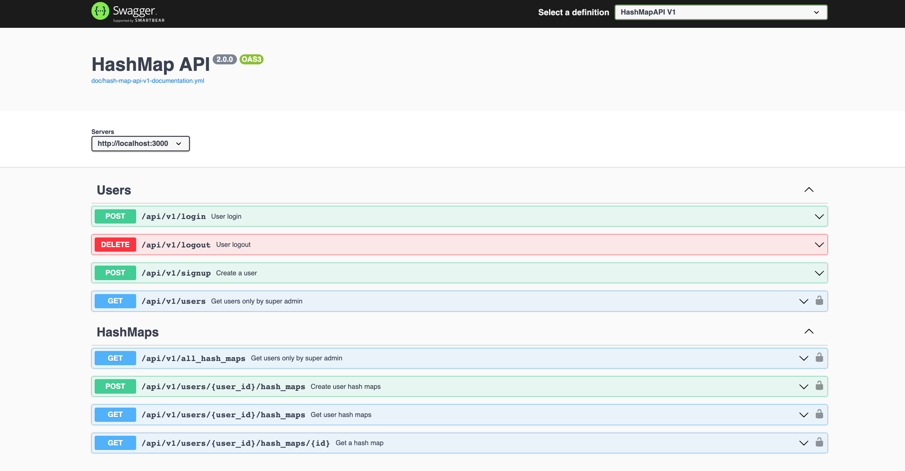

# HashMapAPI documentation

## Running the Swagger UI

- install docker and docker-compose
- `docker-compose up`
- visit [localhost:8083](http://localhost:8083)

## Hash Map V1 API

This api documentation is to demonestate some of the API endpoints needed to interact with HashMap project.

NB: Remeber to run `hash-map-api` before doing any operation

